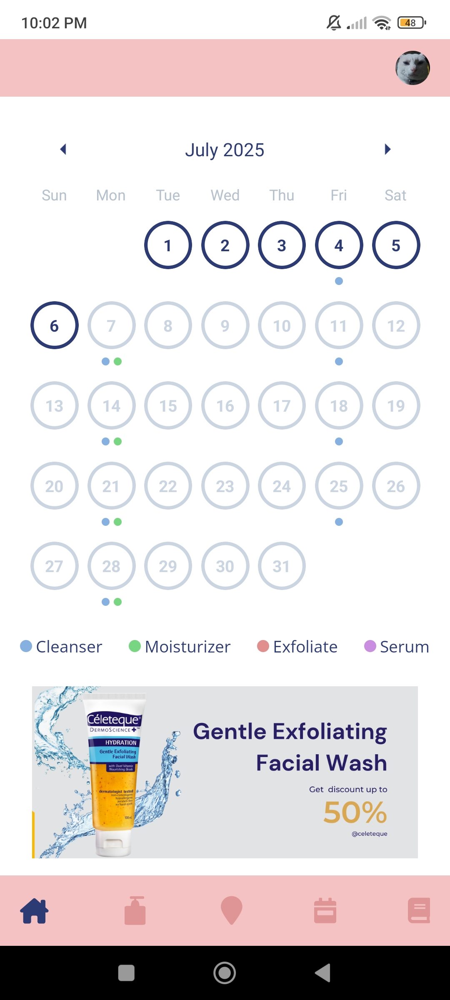
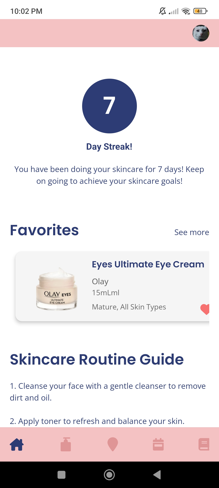
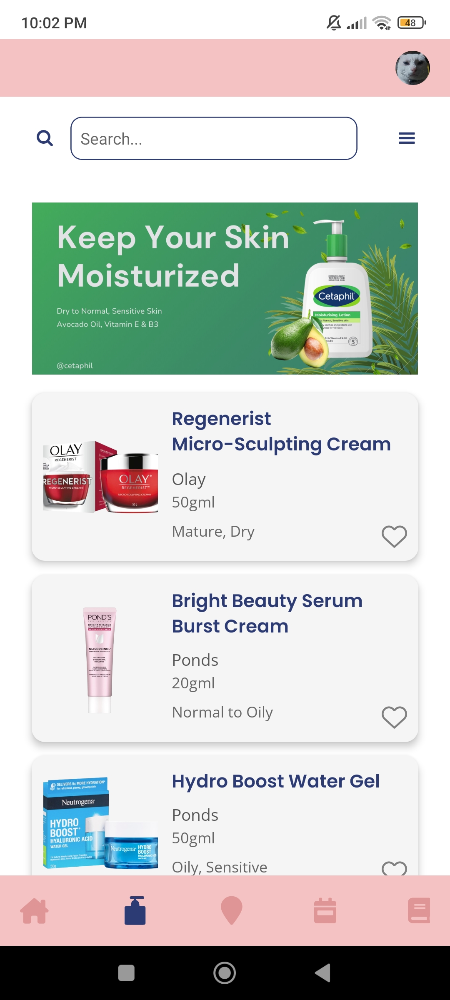
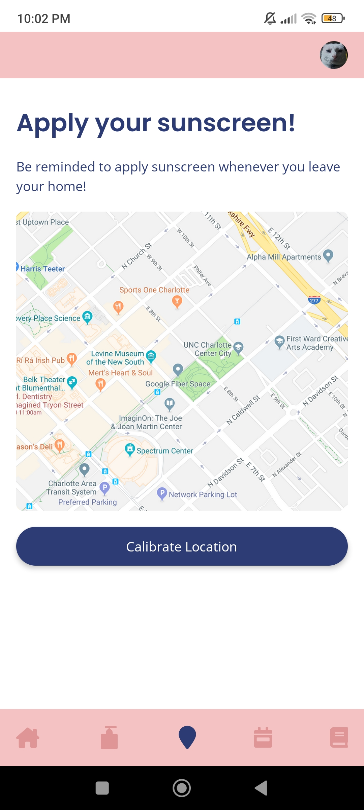
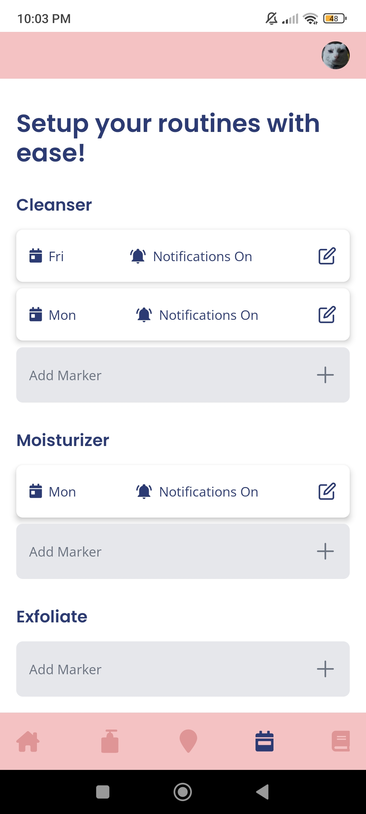
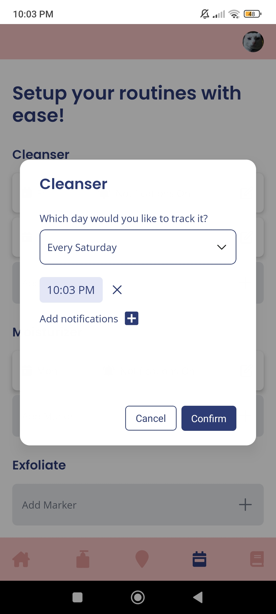
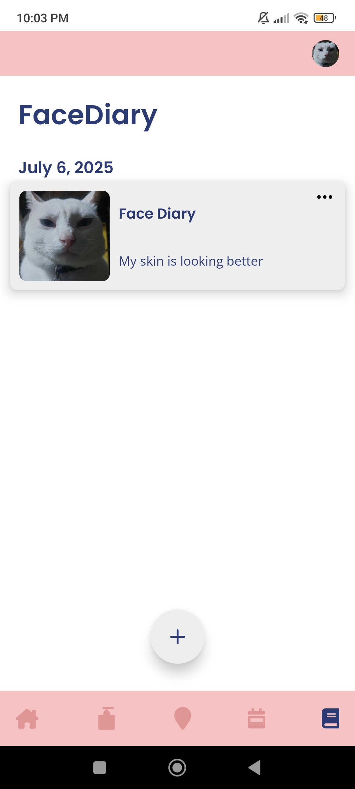
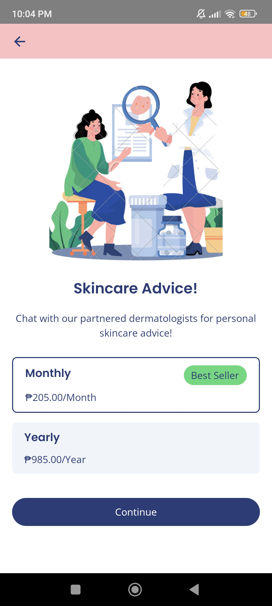
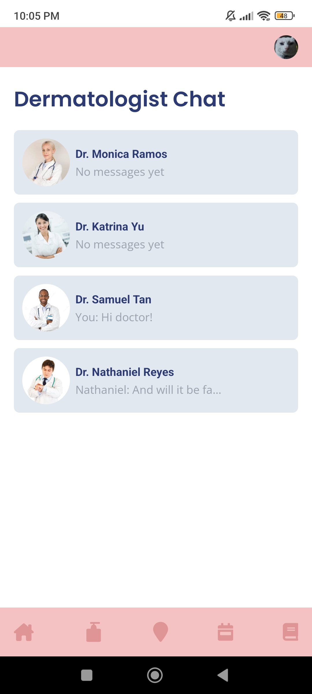
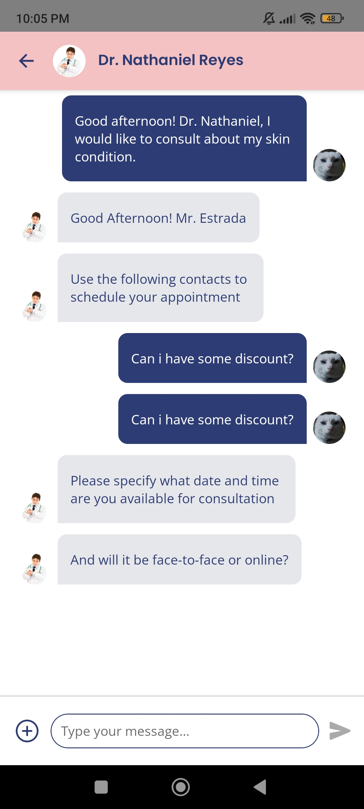

# Facecard: Skincare Tracker Mobile App 👩👨

Facecard is a skincare tracker app that provides a seamless and efficient skincare tracking experience for everyone's skincare journey.

# Features ⚙️ 
- **Calendar Tracking**
- **Skincare Products List**
- **Sunscreen Alert**
- **Routine Scheduling**
- **Face Diary**
- **Streaks**
- **Dermatologist Consultation**

# Screenshots 📷

# Tools and Technologies 💻
### Tech stack

### Tools

# Known Issues 🔧
- **Limited skincare products**
- **Offline to Online Syncing**
- **UI Design Improvements**

# Future Features 👨‍🏭
- **Offline mode**
- **Admin Interface**
- **Custom API for skincare products**

# Collaborators 👥
- **<a href="https://github.com/ManingasA">ManingasA</a>**

# Author 👨‍💼
**Email**: estrada.lnp@gmail.com

**Github**: https://github.com/STI-TakoYucky

**Web Portfolio**: https://lucky-estrada.vercel.app/

